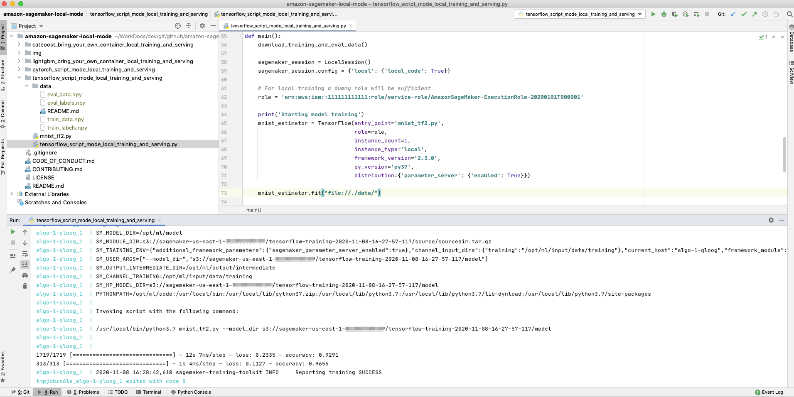
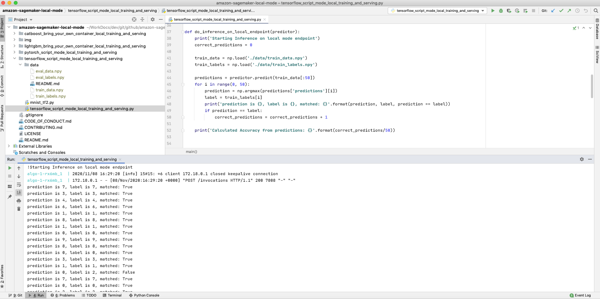

## Amazon SageMaker Local Mode Examples

This repository contains examples and related resources showing you how to train and serve on your local machine using Amazon SageMaker Local mode for training and serving. 

## Overview

The local mode in the Amazon SageMaker Python SDK can emulate CPU (single and multi-instance) and GPU (single instance) SageMaker training jobs by changing a single argument in the TensorFlow, PyTorch or MXNet estimators.  To do this, it uses Docker compose and NVIDIA Docker.  It will also pull the Amazon SageMaker TensorFlow, PyTorch or MXNet containers from Amazon ECS, so you’ll need to be able to access a public Amazon ECR repository from your local environment.

## SageMaker local mode training and serving in PyCharm
This repository examples will work in any IDE on your local machine. 

Here you can see a TensorFlow example running on PyCharm. **The data for training and serving is also located on your local machine file system**.

#### SageMaker local mode training in PyCharm

#### SageMaker local mode serving in PyCharm

### Repository Structure

The repository contains the following resources:

- **TensorFlow resources:**  

  - [**TensorFlow Script Mode Training and Serving**](tensorflow_script_mode_local_training_and_serving):  This example shows how to train and serve your model with TensorFlow and SageMaker script mode, on your local machine using SageMaker local mode.
  
- **PyTorch resources:**  

  - [**PyTorch Script Mode Training and Serving**](pytorch_script_mode_local_training_and_serving):  This example shows how to train and serve your model with PyTorch and SageMaker script mode, on your local machine using SageMaker local mode.   

- **Bring Your Own Container resources:**  

  - [**Bring Your Own Contianer CatBoost Algorithm**](catboost_bring_your_own_container_local_training_and_serving):  This example provides a detailed walkthrough on how to package a CatBoost algorithm for training and production-ready hosting. We have included also a Python file for local training and serving that can run on your local computer, for faster development.    
  - [**Bring Your Own Contianer LightGBM Algorithm**](lightgbm_bring_your_own_container_local_training_and_serving):  This example provides a detailed walkthrough on how to package a LightGBM algorithm for training and production-ready hosting. We have included also a Python file for local training and serving that can run on your local computer, for faster development.
  

### Installation Instructions

1. [Create an AWS account](https://portal.aws.amazon.com/gp/aws/developer/registration/index.html) if you do not already have one and login.

2. Install [Docker Desktop for Mac](https://hub.docker.com/editions/community/docker-ce-desktop-mac)

3. [Install the AWS CLI](https://docs.aws.amazon.com/cli/latest/userguide/install-cliv2-mac.html#cliv2-mac-install-gui) and [Configure AWS credentials](https://docs.aws.amazon.com/cli/latest/userguide/cli-configure-quickstart.html#cli-configure-quickstart-config).

4. Clone the repo onto your local development machine using `git clone`.

5. Open the project in any IDE of your choice in order to run the example Python files.

6. Follow the instructions on which Python packages to install in each of the example Python file.

## Questions?

Please contact [@e_sela](https://twitter.com/e_sela) or raise an issue on this repo.

## License

This library is licensed under the MIT-0 License. See the LICENSE file.
